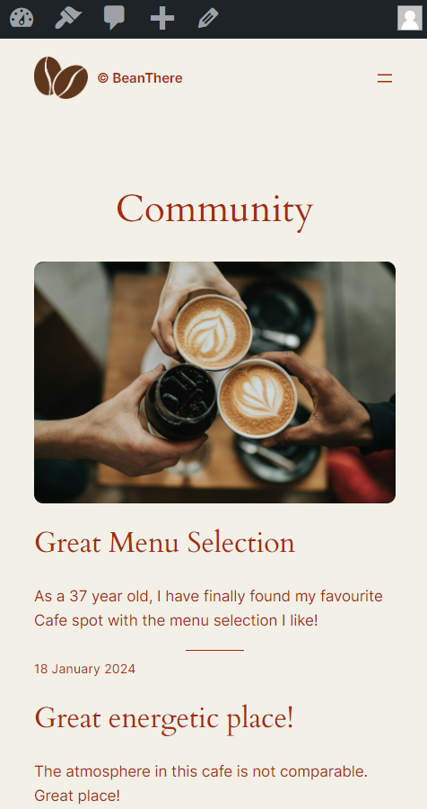

# BeanThere
Developed the BeanThere cafe website on WordPress, featuring custom plugins for Events, Menus, Maps, and a dynamic schedule display, tailored for enhanced user experience and operational efficiency.

You can see more about the website in this video of mine: https://youtu.be/KFZN4yjWTac?si=yuF4WeabzD8-luEd

